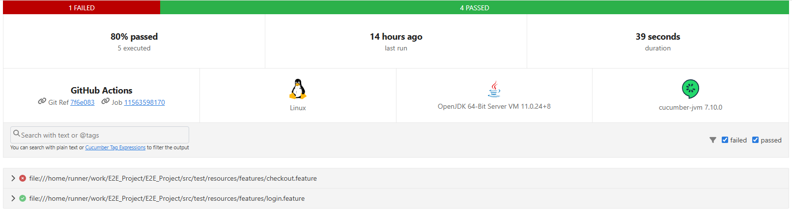

# Projeto de Testes E2E com Cucumber

## Descrição

Este projeto utiliza o Cucumber para realizar testes de em uma aplicação web de exemplo, utilizando o padrão de BDD

## Configuração do Projeto

### Pré-requisitos

Certifique-se de que você tem instalado em sua máquina:

- [Java JDK 11](https://www.oracle.com/java/technologies/javase-jdk11-downloads.html)

### Clonando o Repositório

```
git clone https://github.com/carlos-gl/E2E_Project.git
```
Utilize sua IDE de preferência para executar o projeto (Sugetão: InteliJJ).

## Como Funciona o Projeto
### Cenários de Teste: 
Os cenários de teste estão definidos em arquivos .feature na pasta src/test/resources/features/.

### Definições de Passos: 
As definições de passos correspondentes estão na pasta src/test/java/stepDefinitions/.

### Executando os Testes:
```
mvn clean test
```

#### O mesmo também é executado através do github actions, está configurado para rodar a esteira a cada commit.
### Padrões Utilizados
#### BDD (Behavior Driven Development).
#### Page Object Model (POM).

### Resultados dos Testes
Os resultados dos testes são gerados em formato HTML e JSON, na pasta target/cucumber-reports/



Nesse projeto dos cenários executados tivemos 4 passados com sucesso e 1 com falha.

O cenário com falha foi `Falha ao tentar finalizar compra sem preencher produtos` cenário esperado era que o sistema não permitisse finalizar compra sem informar produto, porém não ocorreu o esperado.